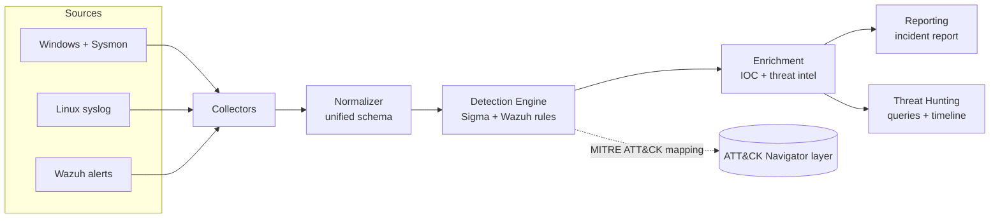

# BlueForge

**Detection Engineering and SOC Automation Platform**
_Dual-stack: Wazuh (open source SIEM) + Microsoft Sentinel / Defender XDR._


BlueForge is a personal blue-team platform that mirrors how a real Security Operations Center
turns raw logs into detections, alerts, investigations, and reports. It is built the way an
internal enterprise security tool would be built: modular Python, versioned detections,
tests, documentation, and a reproducible lab.

> This is a portfolio project by a SOC / Detection Engineering candidate. It is designed to be
> understood end to end, explained in interviews, and grown over months.

---

## Why this exists

A SOC analyst is measured on one thing: can you take a signal, decide if it is real, and act on it
correctly and quickly. BlueForge is the toolchain around that loop:

1. **Collect** logs (Windows Event Log, Sysmon, Linux, Wazuh alerts).
2. **Normalize** them into one consistent schema so detections do not care about log format.
3. **Detect** using Sigma rules and Wazuh rules, each mapped to MITRE ATT&CK.
4. **Enrich** alerts with IOC extraction and threat intel lookups.
5. **Investigate** with hunting queries, timelines, and playbooks.
6. **Report** with an auto-generated incident report.

Every stage answers four questions, because that is how the author learns: **why** the component
exists, **how** it works, **how an attacker abuses** the underlying technique, and **how a
defender detects** it.

## Architecture (high level)



Full diagrams and trade-offs live in [`docs/03-architecture.md`](docs/03-architecture.md).

## Quickstart

```bash
git clone https://github.com/Ravi-O3/blueforge.git
cd blueforge
python -m venv .venv && source .venv/bin/activate
make install            # installs deps + the blueforge package
cp .env.example .env    # fill in optional API keys
blueforge --help        # see available commands
make test               # run the test suite
```

## Repository layout

```
blueforge/
  src/blueforge/     Python package (collectors, normalizer, detections, enrichment, reporting, hunting)
  detections/        Versioned detection content (sigma/, wazuh/, sentinel/)
  docs/              Master blueprint + architecture, roadmap, playbooks, templates
  diagrams/          Mermaid architecture, data-flow, network, component diagrams
  labs/              Reproducible attack/detection labs (with a Wazuh docker lab)
  examples/          Sample logs used by tests and demos
  tests/             pytest suite
  scripts/           Helper scripts (e.g. ATT&CK coverage report)
  screenshots/       Evidence for the portfolio (lab runs, alerts, dashboards)
```

A file-by-file explanation is in [`docs/02-repository-structure.md`](docs/02-repository-structure.md).

## Detection coverage

Detections are the core deliverable. Each rule is a small YAML/XML file with a title, the
MITRE technique it maps to, the log it fires on, known false positives, and investigation steps.
Current content: 8 Sigma rules and 8 Wazuh rules covering 8 ATT&CK techniques across
execution, persistence, credential access, discovery, ingress tool transfer, and account
creation. Every Sigma rule has a firing test and a false-positive (negative) test in `tests/`.

Measure and visualize coverage:

```bash
python scripts/attack_coverage.py          # technique -> rule summary
python scripts/attack_coverage.py --layer  # writes docs/attack_navigator_layer.json
```

Load the layer at the [ATT&CK Navigator](https://mitre-attack.github.io/attack-navigator/)
to see coverage heat-mapped on the enterprise matrix. See the full plan
(20 Sigma + 20 Wazuh detection ideas) in
[`docs/08-detection-engineering-plan.md`](docs/08-detection-engineering-plan.md) and the
authoring guide in [`docs/detection-guide.md`](docs/detection-guide.md).

## Roadmap

Built in phases so it stays shippable at every step. Summary below, detail in
[`docs/05-roadmap.md`](docs/05-roadmap.md).

| Phase | Theme | Outcome |
|-------|-------|---------|
| 0 | Foundation | Repo, docs, lab, CI |
| 1 | MVP | Collect + normalize one log source, first 3 detections |
| 2 | Detection Engine | Sigma runner, 20+ rules, MITRE mapping |
| 3 | Threat Hunting | Hunting queries, timelines, attack simulations |
| 4 | Automation | IOC extraction, enrichment, incident reports |
| 5 | AI (optional) | Local LLM alert explanation and query helper |
| 6 | Enterprise polish | Sentinel/KQL parity, coverage dashboard |

## Documentation

The complete design lives in [`docs/`](docs/). Start with
[`docs/00-master-blueprint.md`](docs/00-master-blueprint.md).

## Security

This repo ships detection logic and lab attack notes. Handle responsibly. See
[`SECURITY.md`](SECURITY.md). Never commit real logs, secrets, or customer data.

## License

MIT. See [`LICENSE`](LICENSE).
