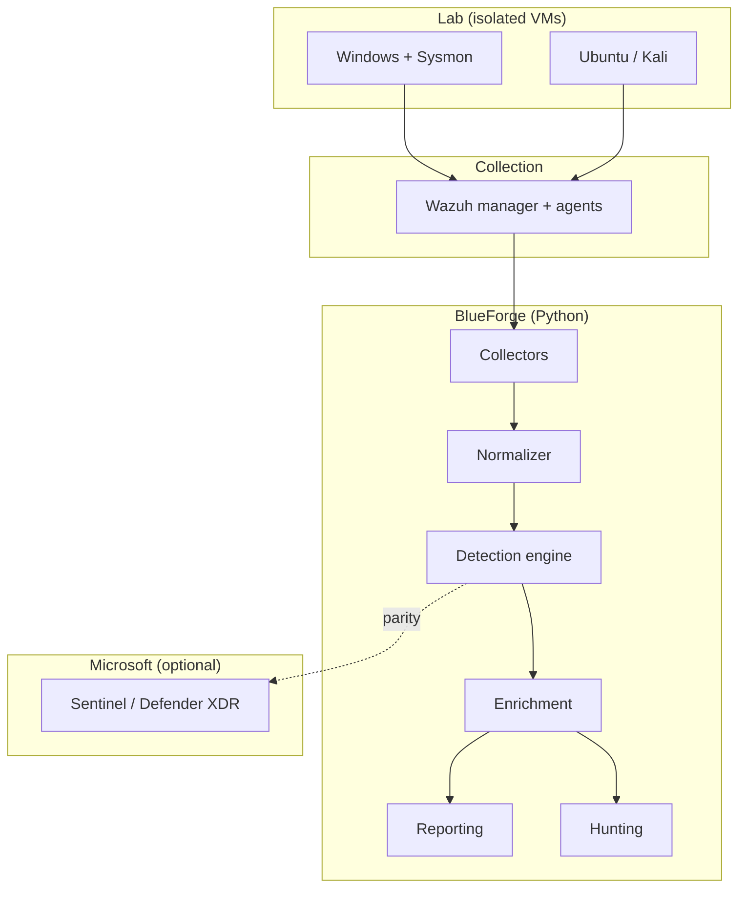
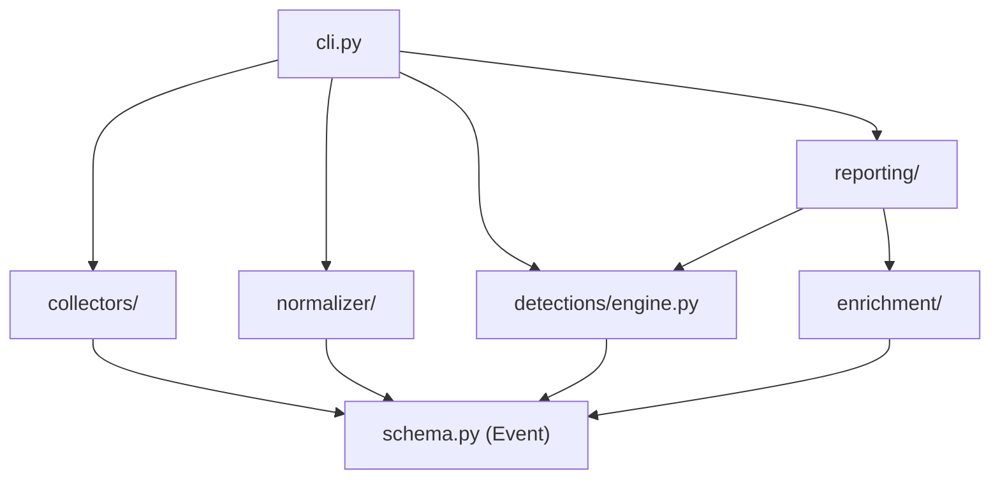
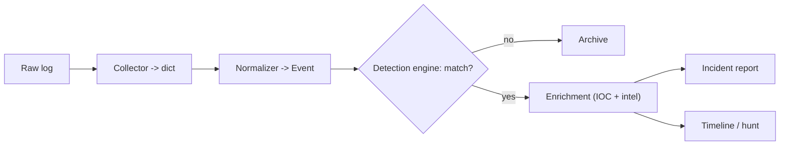
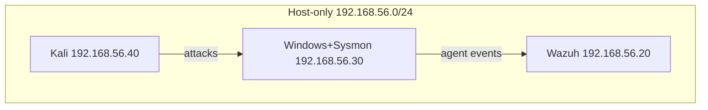

# 03. Architecture

## High-level architecture

BlueForge is a linear pipeline with two clearly separated halves: an **infrastructure** half
(the lab and Wazuh that produce logs) and a **software** half (the Python that processes them).
The Microsoft stack is an optional parallel track for Sentinel/KQL parity.

Why a pipeline and not something fancier: a pipeline is the honest shape of the problem (data
moves one direction, stage by stage), and it is the easiest thing to explain and test. Each stage
has a single responsibility and a typed interface (`Event`), so any stage can be replaced without
touching the others.

## Component diagram

Everything points at `schema.Event`. That is intentional: the schema is the contract, and it is
the one file you should read first to understand the whole system.

## Data flow (one event, end to end)

## Network diagram (lab)

The lab uses a host-only network so simulated attacks never touch the real network or the
internet. This is a deliberate safety and containment decision, and a good thing to say out loud
in an interview: you understand blast radius.

## Why each component exists, alternatives, trade-offs

**Collectors.** Exist because acquiring data is a distinct job from understanding it. Alternative:
have each parser read files directly. Rejected because it couples detection code to file formats.
Trade-off: one extra layer, but adding a log source becomes trivial.

**Normalizer + common schema.** The heart of the design. Alternative: write detections per log
format. Rejected because it multiplies rule maintenance by the number of formats. Trade-off: you
must design the schema up front and maintain mappers, but you write each detection once. This is
exactly what Elastic (ECS) and Sentinel (ASIM) do.

**Detection engine (custom mini-Sigma).** Exists so you can explain precisely how a rule fires.
Alternative: use the full `pySigma` library. Rejected for now because a black box you cannot
explain is worthless in an interview; the custom engine is ~120 lines and covers the common
operators. Trade-off: it supports a subset of Sigma, not the whole spec. Documented as such, and
the real Sigma files remain valid for use with pySigma later.

**Enrichment.** Exists because an alert without context is just noise. Threat-intel calls are
optional and degrade gracefully (no API key = "unknown"), so the core runs offline and tests stay
deterministic. Alternative: block on live lookups. Rejected because it makes the tool fragile.

**Reporting.** Exists because an analyst's real deliverable is a clear write-up. Markdown was
chosen because it renders on GitHub, pastes into a ticket, and converts to PDF.

**Wazuh as the SIEM core.** Chosen because it is free, realistic, runs on the existing VMs, maps
rules to MITRE natively, and gives genuine enterprise-tool experience. Alternative: Elastic
Security or Splunk Free. Wazuh wins on ease of self-hosting and MITRE mapping. Trade-off: less
market share than Splunk, mitigated by the Sentinel/KQL parity track.

**Microsoft Sentinel parity (optional track).** Exists to align with SC-200 and the Canadian
Microsoft-heavy market. Kept optional because it needs an Azure subscription. Trade-off: cost and
trial limits, so it is a Phase 4+ concern, not a dependency of the core.
